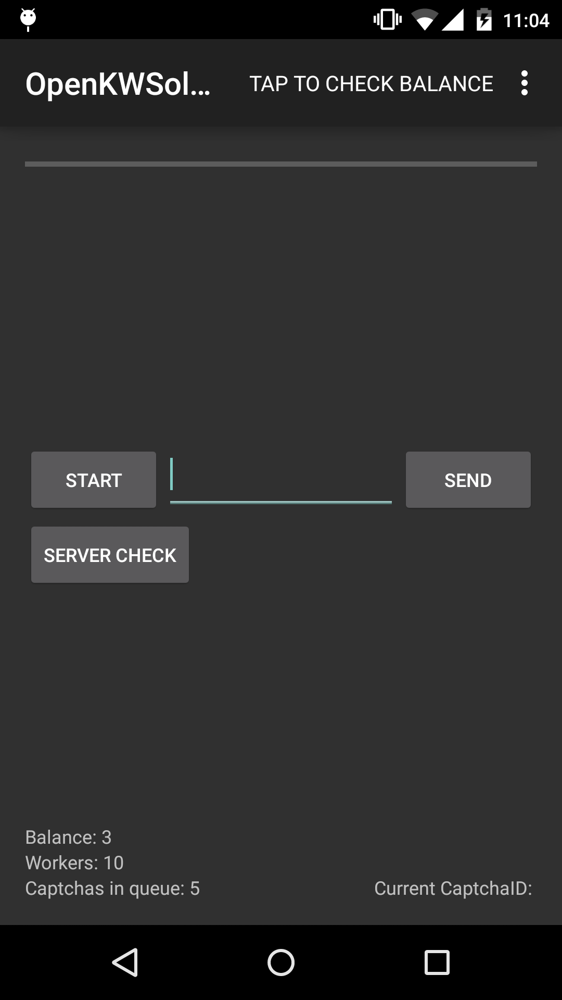

OpenKWSolver
============

Light and easy to use mobile [9kw.eu](http://www.9kw.eu/)-Solver. (~950kb!)

Using
-----

targetSDK: 21 (5.0 Lollipop)
minSDK: 14 (+4.0 Ice Cream Sandwich) Untested on 4.4 and below!
To work with it, you'll need a device with Android 4.0 and above. 5.0 would be best. Also, an account on [9kw.eu](http://www.9kw.eu/), as well as an API-Key would be an advantage.
The app won't work without API-Key. You can get the current Version beta.4 apk [here](https://github.com/dotWee/OpenKWSolver/releases/download/beta.4/app-release_SIGNED_beta.4.apk).

Building
--------

Just clone that git-project, or download it as zip [here](https://github.com/dotWee/OpenKWSolver/archive/master-rewrite.zip) and import it to Android Studio!

Used Permissions
----------------

+ .ACCESS_NETWORK_STATE to check if network is available
+ .INTERNET to request Captcha and download Image
+ .VIBRATE to signalize a new Captcha arrived

Features
--------

+ Servercheck (Current worker-count, Captchas in Queue)
+ Auto-pull new Captcha
+ Captcha-debug mode
+ Self-only Captchas

Screenshots
-----------

<table sytle="border: 0px;">
<tr>
<td></td>
</tr>
</table>

Todo
----

+ Use 9kw's history API to view answered Captchas
+ Make it look beautiful and tidy up the code
+ Vibrate as soon as new Captcha arrives
+ Backport to lower Android API's
+ Let user decide the loop mode (in work)
+ Log for better debug
+ Add Click mode
+ Documentation
+ Add an Icon

Found a bug / had a force-close?
--------------------------------

Open a new Issue and include a logcat (also, maybe tell me how to reproduce)!
