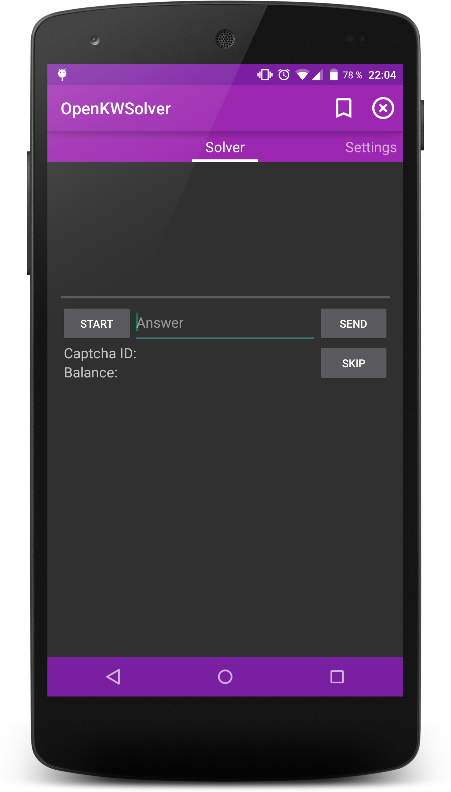
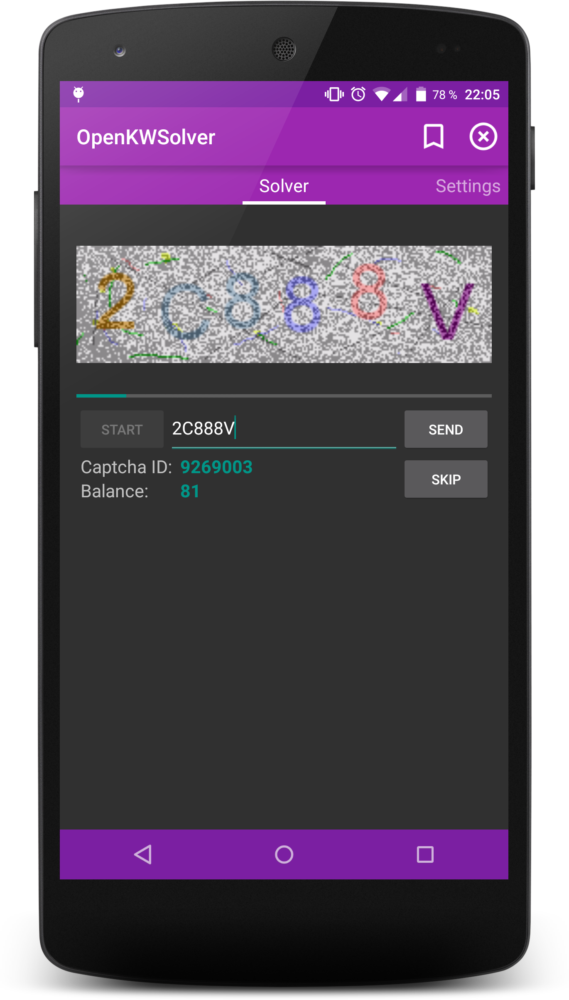
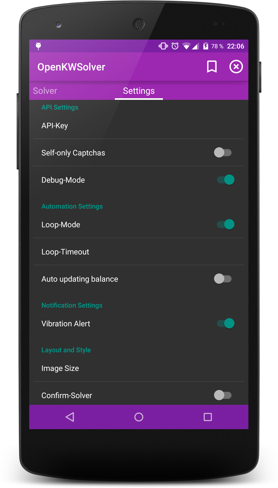
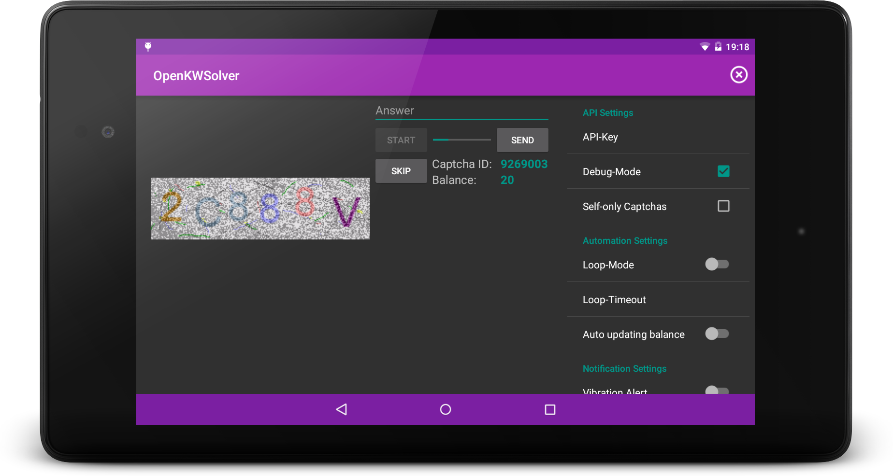

  OpenKWSolver
=================================================================

Solve Captchas for [9kw.eu](http://www.9kw.eu/) the open-source and Material-Design-way!

## Using

minSDK: 16 (4.1 Jelly Bean)
 targetSDK: 22 (5.1.1 Lollipop)

To use OpenKWSolver, you need an account on [9kw.eu](http://www.9kw.eu/), as well as an API-Key (grab one at [9kw.eu/userapi](http://www.9kw.eu/userapi.html)).
 Latest **stable** release (v1.7) is available on the [Google Play Store](https://play.google.com/store/apps/details?id=de.dotwee.openkwsolver), as well as under the [release-section](https://github.com/dotWee/OpenKWSolver/releases) of this github repository.

## Checksums

<table>
  <tr>
    <td>sha1 (release v1.7)</td>
    <td><code>a76a82f2b8359443683237d3baaaf9650b20aace</code></td>
  </tr>
</table>

## Building

Automatically: use Android Studio's 'Check out from Version Control' - feature and use the URL of this project as source.  
Manually: clone this git-repository or download it as zip [here](https://github.com/dotwee/OpenKWSolver/archive/master.zip), extract and import it into Android Studio.

## Used Permissions

+ .INTERNET to request Captcha and download Image
+ .ACCESS_NETWORK_STATE to check if network is available
+ .VIBRATE to signalize the arrivement of a new Captcha

## Screenshots

<table style="border: 0px;">
    <tr>
        <td></td>
        <td></td>
        <td></td>
    </tr>
</table>

## Todo

+ Use 9kw's history API to view answered Captchas
+ Make it look beautiful and tidy up the code
+ Add Click mode and improve Confirm
+ Loading animation
+ Documentation

## Changelog

Date: (work in progress; upcoming)
> Version v1.8
 + Improvements:
		- Reduced application-size
		- Removed deprecated code
		- Reduced memory-usage
		- Reworked solver-code
		- Refactored loop-code
		- Updated titles & descriptions
		- Removed about category
 + Layout changes:
		- Allow switching between dark & light theme
		- Slightly different color-scheme
		- Loading-animation for captchas
 + Minor:
		- Compiled with latest build-tools
		- Updated libraries
		- Values cleanup

Date: (06/04/2015)
> Version v1.7
 + Improvements: 
		- Loop-Mode
		- Cleaned menu
		- First-use code
 + Layout changes: 
		- Display CaptchaID by default
		- New Tablet & landscape layout
 + Minor:
		- Built with latest build-tools
		- New about preference-category

Date: 24/03/2015
> Version v1.6.1 (Fast-fix)
 + Fixs: 
		- Prevent Force-close on application exit
		- Prevent Force-clone on startup

Date: 20/03/2015
> Version v1.6
 + Improvements: 
		- Removed deprecated apache http API
		- Removed unstable confirm fragment
 + Layout changes: 
		- Preference to enable / disable CaptchaID TextView
		- Preference for ImageView now updates immediately
		- Preference to play sound on new Captcha
 + Minor:
		- Skip Captcha as soon as ProgressBar finishes
		- Disable all buttons if no API-key is set
		- Updated application license

## Found a bug / had a force-close?

Feel free to open a new Issue and please provide a logcat.

## Dependencies

+ Google's v7 AppCombat
+ Google's v13 Support Package
(Both used to bring Material Design to API < 21)

## Credits

+ Google: for their [Material Design Icons](https://github.com/google/material-design-icons) (Attribution 4.0 Internal license)

## License

Copyright (c) 2015 Lukas 'dotwee' Wolfsteiner
Licensed under the [_Do What The Fuck You Want To_](/LICENSE) public license