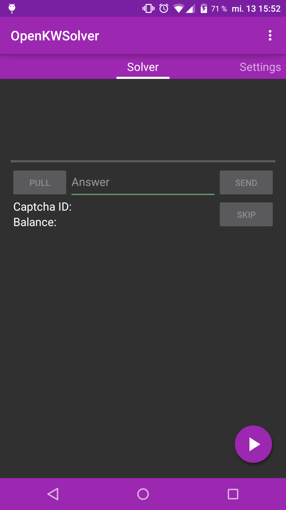
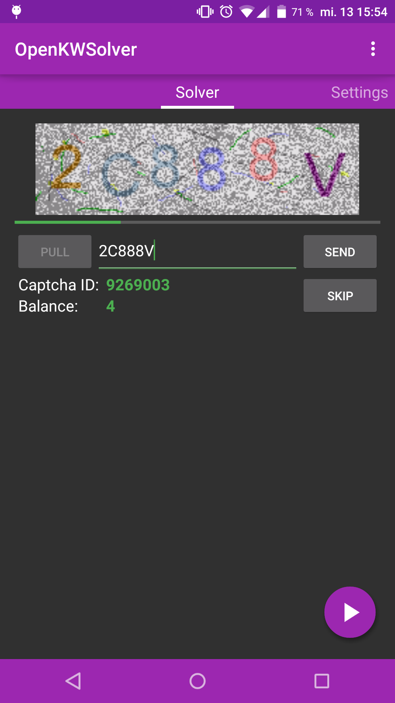
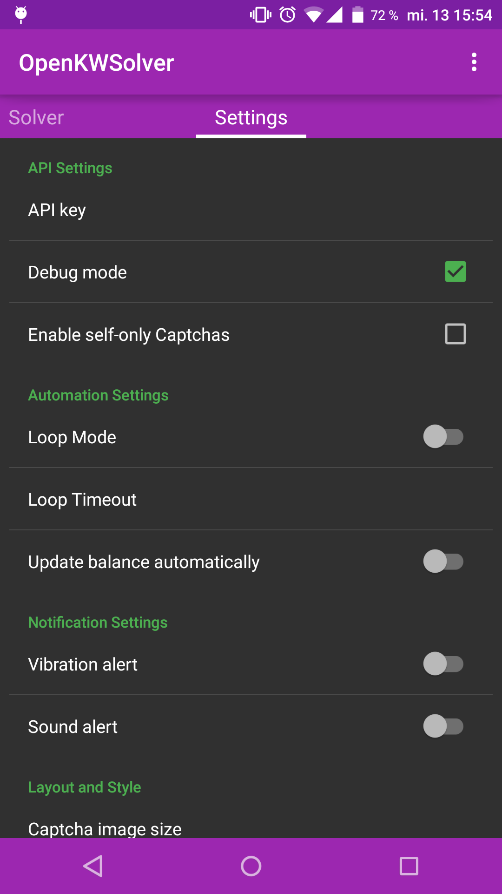
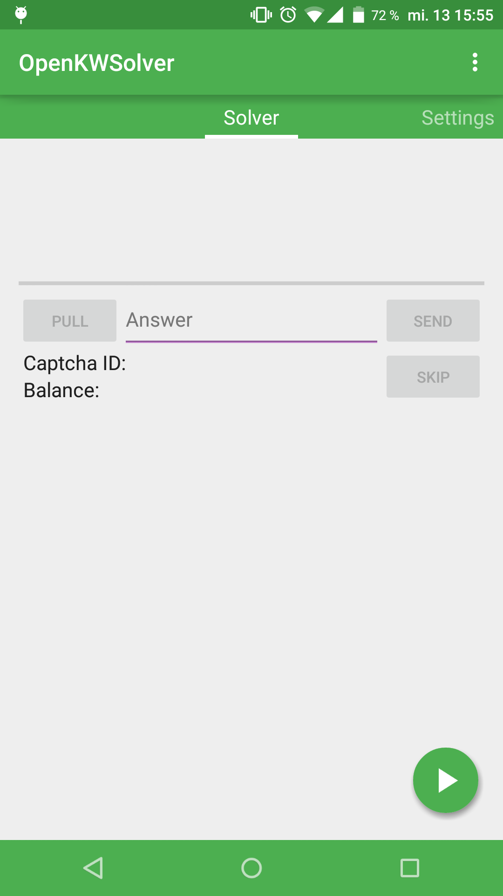
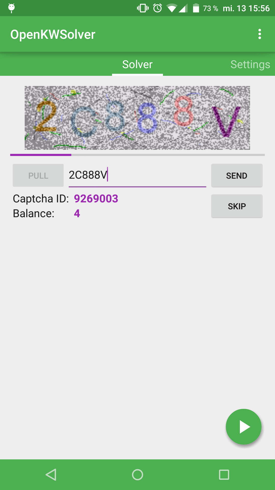
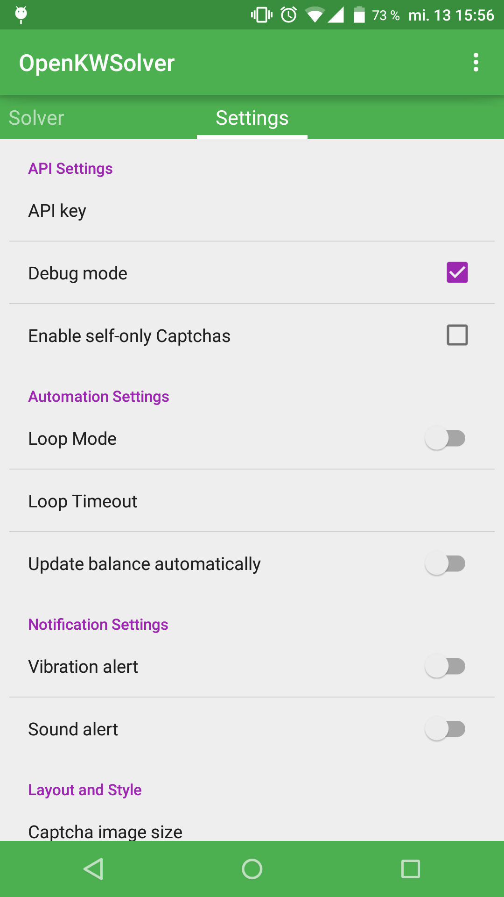

#  OpenKWSolver 

Solve Captchas for [9kw.eu](http://www.9kw.eu/) the open-source and Material-Design-way!

## Using

minSDK: 16 (4.1 Jelly Bean)
 targetSDK: 22 (5.1.1 Lollipop)

To use OpenKWSolver, you need an account on [9kw.eu](http://www.9kw.eu/), as well as an API-Key (grab one at [9kw.eu/userapi](http://www.9kw.eu/userapi.html)).
 Latest **stable** release (v1.7) is available on the [Google Play Store](https://play.google.com/store/apps/details?id=de.dotwee.openkwsolver), as well as under the [release-section](https://github.com/dotWee/OpenKWSolver/releases) of this github repository.

## Checksums

| version code 	| version code 	| sha1-checksum                            	|
|--------------	|--------------	|------------------------------------------	|
| v1.7         	| 18           	| a76a82f2b8359443683237d3baaaf9650b20aace 	|
| v1.6.1       	| 17           	| 541eb568fc44cc15c1a463e2cb4eeb166bb50a54 	|
| v1.6         	| 16           	| 39bd6cbd4884fd6cc2846b602284136c2ba9d209 	|
| v1.5         	| 15           	| 1d6ed83983b0e357cf99daf9fd5fac393823c564 	|
| v1.4         	| 14           	| d4be2961fce39c1a7a6da8414fd2c2a11ab78902 	|

## Building

Automatically: use Android Studio's 'Check out from Version Control' - feature and use the URL of this project as source.  
Manually: clone this git-repository or download it as zip [here](https://github.com/dotwee/OpenKWSolver/archive/master.zip), extract and import it into Android Studio.

## Used Permissions

+ .INTERNET to request Captcha and download Image
+ .ACCESS_NETWORK_STATE to check if network is available
+ .VIBRATE to signalize the arrivement of a new Captcha

## Screenshots

&nbsp;
&nbsp;

&nbsp;
&nbsp;

## Todo

+ Use 9kw's history API to view answered Captchas
+ Make it look beautiful and tidy up the code
+ Add Click mode and improve Confirm
+ Loading animation
+ Documentation

## Upcoming version / changes

###### Version v1.8
Date: unknown

* Improvements:
  - Updated titles & descriptions
  - Removed about category
  - Reduced application-size
  - Removed deprecated code
  - Reduced memory-usage
  - Reworked solver-code
  - Refactored loop-code

* Layout changes:
  - Allow switching between dark & light theme
  - Slightly different color-scheme
  - Loading-animation for captchas

* Minor:
  - Compiled with latest build-tools
  - Updated libraries
  - Values cleanup

## Bug / force-close?

Feel free to open a new Issue and please provide a logcat.

## Dependencies

+ Google's v7 AppCombat
+ Google's v13 Support Package
(Both used to bring Material Design to API > 21)

## Changelog

Check the [changelog](/docs/CHANGELOG.md)-file.

## Credits

+ Google: for their [Material Design Icons](https://github.com/google/material-design-icons) (Attribution 4.0 Internal license)

## License

Copyright (c) 2015 Lukas 'dotwee' Wolfsteiner
This project is licensed under the [_Do What The Fuck You Want To_](/LICENSE) public license.

