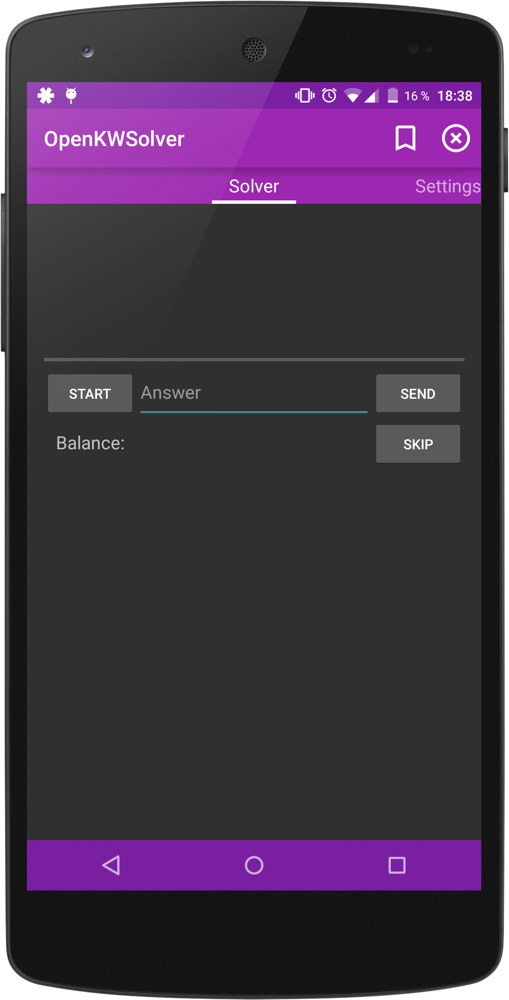
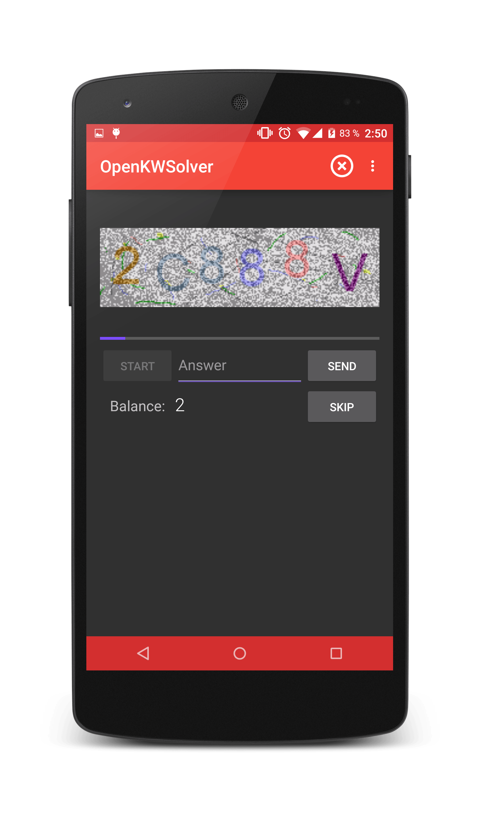
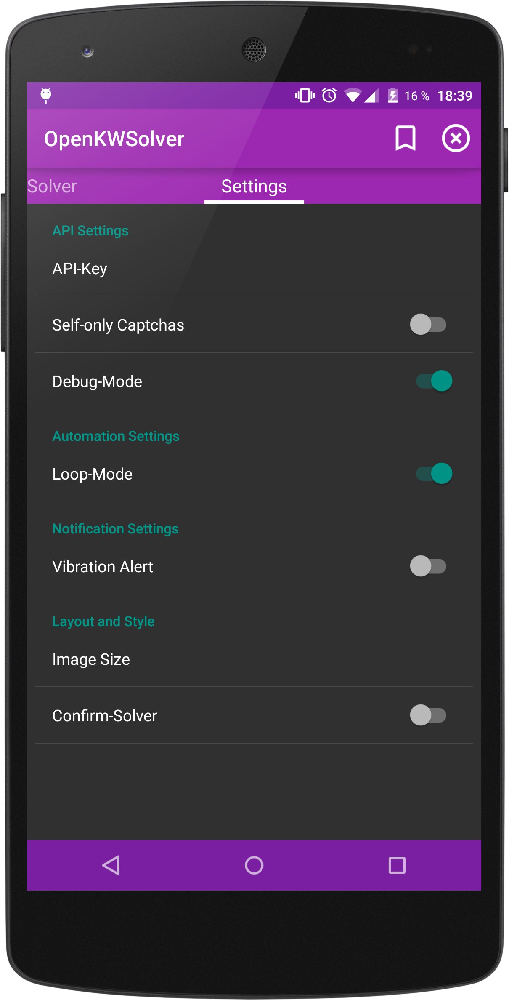

  OpenKWSolver
=================================================================

Light and easy to use mobile [9kw.eu](http://www.9kw.eu/)-Client.

Using
-----

minSDK: 16 (4.1 Jelly Bean)
 targetSDK: 22 (5.1 Lollipop)

To use OpenKWSolver, you need an account on [9kw.eu](http://www.9kw.eu/), as well as an API-Key (grab one at [9kw.eu/userapi](http://www.9kw.eu/userapi.html)).
 Latest stable release (v1.2) is available [here](https://github.com/dotWee/OpenKWSolver/blob/master/app-release.apk?raw=true) or as debug-version [here](https://github.com/dotWee/OpenKWSolver/blob/master/app-debug.apk?raw=true) as well as under the release-section of this github repository.

Checksums
---------

<table>
  <tr>
    <td>md5 (release v1.2)</td>
    <td><code>093aad99542bb923e14ff742d21b8e1e</code></td>
  </tr>
  
  <tr>
    <th>md5 (debug v1.2)</th>
    <th><code>4a98b5ac1adb1b82b8c79fe3f8de96ae</code></th>
  </tr>
</table>

Building
--------

Automatically: use Android Studio's 'Check out from Version Control' - feature and use the URL of this project as source.  
Manually: clone this git-repository or download it as zip [here](https://github.com/dotwee/OpenKWSolver/archive/master.zip), extract and import it into Android Studio.

Used Permissions
----------------

+ .ACCESS_NETWORK_STATE to check if network is available
+ .INTERNET to request Captcha and download Image
+ .VIBRATE to signalize the arrivement of a new Captcha

Features
--------

+ Loop-Mode (Auto-pull next Captcha)
+ Selectable Captcha-image size
+ Vibrate on Captcha-arrival
+ View your current balance
+ Captcha - debug mode
+ Self-only Captchas

Screenshots
-----------

<table style="border: 0px;">
    <tr>
        <td></td>
        <td></td>
        <td></td>
    </tr>
</table>

Todo
----

+ Use 9kw's history API to view answered Captchas
+ Make it look beautiful and tidy up the code
+ Add Click mode
+ Documentation

Found a bug / had a force-close?
--------------------------------

Open a new Issue and provide a logcat.

Dependencies
------------

+ Google's AppCombat
+ Google's v13 Support Package

Credits
-------

+ Google: for their [Material Design Icons](https://github.com/google/material-design-icons) (Attribution 4.0 Internal license)

License
-------

Copyright 2015 Lukas "dotwee" Wolfsteiner

Licensed under the Apache License, Version 2.0 (the "License");
you may not use this file except in compliance with the License.
You may obtain a copy of the License at

    http://www.apache.org/licenses/LICENSE-2.0

Unless required by applicable law or agreed to in writing, software
distributed under the License is distributed on an "AS IS" BASIS,
WITHOUT WARRANTIES OR CONDITIONS OF ANY KIND, either express or implied.
See the License for the specific language governing permissions and
limitations under the License.